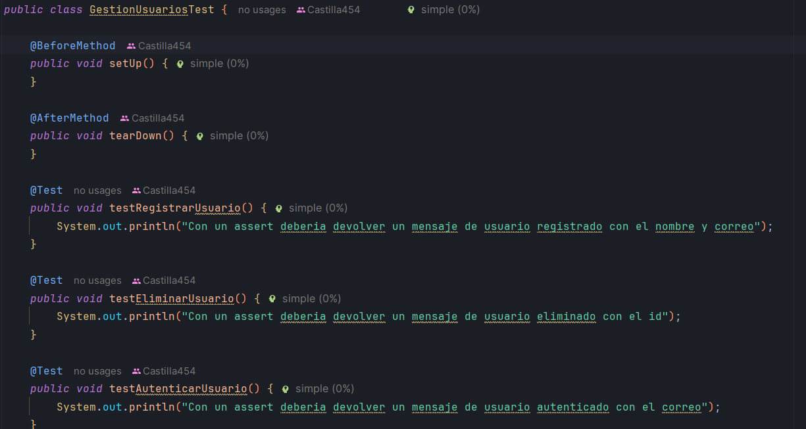
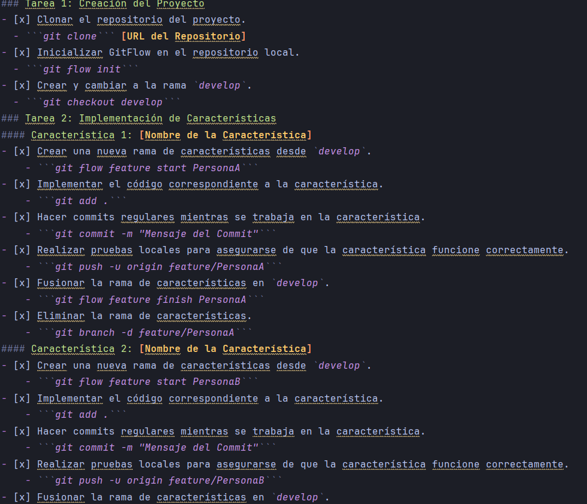

# Tareas de GitFlow
## Nombre del Estudiante: [Alejandro Castilla, Aleksandr Filcakov]
## Fecha de Inicio: [08/05/2024]
Fecha de Finalización: [08/05/2024]
---
### Tarea 1: Creación del Proyecto
- [x] Clonar el repositorio del proyecto.
  - ```git clone``` [URL del Repositorio]
- [x] Inicializar GitFlow en el repositorio local.
  - ```git flow init``` 
- [x] Crear y cambiar a la rama `develop`.
  - ```git checkout develop```
### Tarea 2: Implementación de Características
#### Característica 1: [Rama de la característica PersonaA]
- [x] Crear una nueva rama de características desde `develop`.
    - ```git flow feature start PersonaA```
- [x] Implementar el código correspondiente a la característica.
    - ```git add .``` 
- [x] Hacer commits regulares mientras se trabaja en la característica.
    - ```git commit -m "Mensaje del Commit"```
- [x] Realizar pruebas locales para asegurarse de que la característica funcione correctamente.
    - ```git push -u origin feature/PersonaA``` 
- [x] Fusionar la rama de características en `develop`.
    - ```git flow feature finish PersonaA```
- [x] Eliminar la rama de características.
    - ```git branch -d feature/PersonaA```
#### Característica 2: [Rama de la característica PersonaB]
- [x] Crear una nueva rama de características desde `develop`.
    - ```git flow feature start PersonaB```
- [x] Implementar el código correspondiente a la característica.
    - ```git add .```
- [x] Hacer commits regulares mientras se trabaja en la característica.
    - ```git commit -m "Mensaje del Commit"```
- [x] Realizar pruebas locales para asegurarse de que la característica funcione correctamente.
    - ```git push -u origin feature/PersonaB```
- [x] Fusionar la rama de características en `develop`.
    - ```git flow feature finish PersonaB```
- [x] Eliminar la rama de características.
    - ```git branch -d feature/PersonaB```
### Tarea 3: Integración y Pruebas
- [x] Integrar la rama `develop` en `master`.
  - ```git merge develop```
  - ```git push -u origin master```
- [x] Realizar pruebas exhaustivas en la versión integrada.
    -  
- [ ] Corregir cualquier error o problema encontrado durante las pruebas.
- [x] Confirmar que la versión integrada está lista para ser desplegada en producción.
    - ```git push origin main```
### Tarea 4: Documentación y Entrega
- [x] Crear la documentación del proyecto utilizando Markdown.
  -  
- [x] Completar la sección de introducción, estructura del repositorio, instalación, uso, contribución, licencia,
  archivos de entrega, instrucciones de entrega, plazo de entrega y contacto.
- [x] Revisar y verificar la documentación para asegurarse de que esté completa y precisa.
- [x] Entregar la documentación según las instrucciones del profesor o instructor.
---
